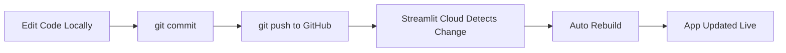

# 🩺 Clinical Assistant - Streamlit Version

> **Hệ thống công cụ hỗ trợ lâm sàng toàn diện cho bác sĩ và nhân viên y tế**  
> Powered by Streamlit + Python

[](https://clinical-assistant.streamlit.app)
[](https://www.python.org/downloads/)
[](LICENSE)

---

## 🎯 Tại Sao Chọn Streamlit?

### ✅ Ưu điểm so với Google Apps Script:

| Feature | Apps Script | **Streamlit** | Winner |
|---------|-------------|---------------|--------|
| **UI/UX** | Basic HTML/CSS | Modern, professional | 🏆 **Streamlit** |
| **Customization** | Limited | Python full control | 🏆 **Streamlit** |
| **Deployment** | Manual/clasp | Auto from GitHub | 🏆 **Streamlit** |
| **Mobile** | OK | Excellent responsive | 🏆 **Streamlit** |
| **Charts/Viz** | Manual code | Built-in plotly/matplotlib | 🏆 **Streamlit** |
| **AI Integration** | Complex | Easy (Gemini, GPT-4) | 🏆 **Streamlit** |
| **Cost** | Free | Free (Community Cloud) | ✅ **Both** |
| **Speed** | OK | Faster with caching | 🏆 **Streamlit** |

---

## 🚀 Bắt Đầu Trong 15 Phút

### Option 1: Deploy to Streamlit Cloud (Khuyến nghị)

```bash
# 1. Fork hoặc clone repo này
git clone https://github.com/YOUR_USERNAME/clinical-assistant.git
cd clinical-assistant

# 2. Push lên GitHub repo của bạn
git remote set-url origin https://github.com/YOUR_USERNAME/clinical-assistant.git
git push -u origin main

# 3. Truy cập Streamlit Cloud
# https://streamlit.io/cloud
# → Sign up with GitHub
# → New app
# → Chọn repo: clinical-assistant
# → Main file: app.py
# → Deploy!

# 🎉 App của bạn live sau 2-3 phút!
```

### Option 2: Chạy Local

```bash
# 1. Clone repo
git clone https://github.com/YOUR_USERNAME/clinical-assistant.git
cd clinical-assistant

# 2. Cài dependencies
pip install -r requirements.txt

# 3. Chạy app
streamlit run app.py

# 4. Mở browser: http://localhost:8501
```

📖 **Chi tiết:** [QUICKSTART_STREAMLIT.md](QUICKSTART_STREAMLIT.md)

---

## 📱 Tính Năng

### Module Hoàn Thành ✅

#### 1. 📊 Scores - Thang Điểm Lâm Sàng
- **qSOFA** - Quick SOFA (Sepsis screening) ✅ **Live**
- SOFA - Sequential Organ Failure Assessment 🚧 Week 2
- CHA₂DS₂-VASc - Stroke risk in AF 🚧 Week 2
- HAS-BLED - Bleeding risk 📋 Week 3
- CURB-65 - Pneumonia severity 📋 Week 3
- GCS - Glasgow Coma Scale 📋 Week 2

#### 2. 💊 Antibiotics - Kháng Sinh
- **CrCl Calculator** (Cockcroft-Gault) ✅ **Live**
- **Database Lookup** ✅ **Live**
- Vancomycin AUC dosing 🚧 Week 2
- Aminoglycoside dosing 🚧 Week 3
- Renal dose adjustment 🚧 Week 2

#### 3. 🫁 Ventilator - Thở Máy
- **ARDSNet Calculator** ✅ **Live**
- **PEEP/FiO₂ Tables** ✅ **Live**
- COPD settings 🚧 Week 3
- Asthma protocol 📋 Week 4
- Obesity adjustments 📋 Week 4

#### 4. 📋 Protocols - Phác Đồ
- **COPD Exacerbation** (GOLD 2025) ✅ **Live**
- **Sepsis 1-Hour Bundle** ✅ **Live**
- DKA Protocol 🚧 Week 3
- UGIB Protocol 🚧 Week 3
- HAP/VAP 🚧 Week 4

### Tính Năng Sắp Có 🚧

- [ ] Drug Interactions Checker
- [ ] Nutrition Calculator (Harris-Benedict)
- [ ] IV Fluids Calculator
- [ ] Lab Interpreter (ABG, CBC)
- [ ] Multi-language (Vietnamese/English)
- [ ] Dark Mode
- [ ] AI Assistant (Gemini integration)
- [ ] PDF Export Results
- [ ] Offline PWA Mode

---

## 🏗️ Kiến Trúc

```
┌─────────────────────────────────────┐
│    Frontend (Streamlit Python)      │
│  - Interactive widgets              │
│  - Real-time updates                │
│  - Responsive layout                │
└─────────────────────────────────────┘
                  ↕
┌─────────────────────────────────────┐
│    Business Logic (Python)          │
│  - Calculators (utils/)             │
│  - Data loaders                     │
│  - Caching (@st.cache_data)         │
└─────────────────────────────────────┘
                  ↕
┌─────────────────────────────────────┐
│      Data Source (CSV/Sheets)       │
│  - data-csv/ (local CSV files)      │
│  - OR Google Sheets (optional)      │
└─────────────────────────────────────┘
```

### Cấu Trúc Thư Mục

```
clinical-assistant/
├── app.py                    # Main entry point
├── pages/                    # Multi-page modules
│   ├── 01_📊_Scores.py
│   ├── 02_💊_Antibiotics.py
│   ├── 03_🫁_Ventilator.py
│   └── 04_📋_Protocols.py
├── utils/                    # Helper functions (future)
│   ├── __init__.py
│   ├── calculators.py
│   └── data_loader.py
├── data-csv/                 # Clinical data
│   ├── Meta.csv
│   ├── Scores.csv
│   ├── Antibiotics.csv
│   ├── Ventilator.csv
│   └── Protocols.csv
├── .streamlit/
│   └── config.toml          # Theme & config
├── requirements.txt          # Python dependencies
├── README_STREAMLIT.md      # This file
└── QUICKSTART_STREAMLIT.md  # Deployment guide
```

---

## 🎨 Customization

### Thay Đổi Theme (Màu Sắc)

Edit `.streamlit/config.toml`:

```toml
[theme]
primaryColor = "#YOUR_COLOR"          # Màu chính
backgroundColor = "#ffffff"            # Background
secondaryBackgroundColor = "#f0f2f6"  # Sidebar
textColor = "#262730"                 # Text
font = "sans serif"                   # Font
```

### Thêm Logo Bệnh Viện

Edit `app.py`:

```python
st.image("assets/hospital_logo.png", width=200)
st.title("Clinical Assistant - [Tên Bệnh Viện]")
```

### Custom CSS

Add trong `app.py`:

```python
st.markdown("""
<style>
    .custom-class {
        /* your CSS here */
    }
</style>
""", unsafe_allow_html=True)
```

---

## 📊 Screenshots

### Desktop View


### Mobile View


---

## 🔄 Auto-Deploy Workflow



**Chỉ cần:**
```bash
git add .
git commit -m "Add SOFA calculator"
git push origin main
```

**Streamlit tự động deploy sau 1-2 phút!**

---

## 📚 Tài Liệu

### Cho Người Dùng
- **[QUICKSTART_STREAMLIT.md](QUICKSTART_STREAMLIT.md)** - Triển khai trong 15 phút
- **[User Guide](#)** - Hướng dẫn sử dụng (coming soon)

### Cho Nhà Phát Triển
- **[Streamlit Docs](https://docs.streamlit.io/)** - Official documentation
- **[IMPLEMENTATION_STREAMLIT.md](#)** - Code chi tiết (coming soon)
- **[API Reference](#)** - Calculator APIs

### Clinical References
- **[RESOURCES.md](RESOURCES.md)** - Guidelines & citations
- **[SIMILAR_APPS.md](SIMILAR_APPS.md)** - Competitor analysis

---

## 🔐 Bảo Mật & Privacy

### ⚠️ CRITICAL: NO PHI (Protected Health Information)

**Ứng dụng này:**
- ✅ KHÔNG lưu trữ thông tin bệnh nhân
- ✅ KHÔNG có database backend
- ✅ KHÔNG track calculations
- ✅ Chỉ thực hiện tính toán realtime

**Để sử dụng an toàn:**
- 📵 Không nhập tên bệnh nhân
- 📵 Không nhập medical record numbers
- 📵 Chỉ nhập số liệu lâm sàng (không định danh)

**Nếu cần lưu kết quả:**
- Copy/paste vào EMR của bệnh viện
- Screenshot (cẩn thận HIPAA)
- Không share link kèm thông tin PHI

---

## 🆘 Troubleshooting

### App không deploy được

**Check logs:**
1. Streamlit Cloud → Your app → Logs tab
2. Tìm error message màu đỏ
3. Common issues:
   - `ModuleNotFoundError` → Thiếu trong `requirements.txt`
   - `FileNotFoundError` → Path sai hoặc file chưa push
   - `SyntaxError` → Python syntax error

### App chạy chậm

**Add caching:**

```python
import streamlit as st

@st.cache_data  # ← Cache này
def load_data(file):
    return pd.read_csv(file)
```

### Update không tự động

**Force rebuild:**
- Streamlit Cloud → App → ⋮ Menu → Reboot app
- Hoặc: Push một commit nhỏ để trigger

---

## 🤝 Đóng Góp

### Báo Lỗi

[GitHub Issues](https://github.com/YOUR_USERNAME/clinical-assistant/issues)

### Đề Xuất Tính Năng

[Feature Requests](https://github.com/YOUR_USERNAME/clinical-assistant/issues/new?labels=enhancement)

### Code Contribution

```bash
# Fork repo
git clone https://github.com/YOUR_USERNAME/clinical-assistant.git
cd clinical-assistant

# Tạo branch mới
git checkout -b feature/new-calculator

# Code, test, commit
git add .
git commit -m "Add new calculator"

# Push và create Pull Request
git push origin feature/new-calculator
```

---

## 📈 Roadmap

### v1.0 (Current) - Foundation
- [x] qSOFA calculator
- [x] CrCl calculator
- [x] ARDSNet ventilator
- [x] COPD protocol
- [x] Sepsis bundle

### v1.1 (Week 2) - Core Calculators
- [ ] SOFA score
- [ ] CHA₂DS₂-VASc
- [ ] Vancomycin dosing
- [ ] GCS calculator

### v1.2 (Week 3-4) - Expansion
- [ ] Drug interactions
- [ ] More protocols (DKA, UGIB, HAP/VAP)
- [ ] Nutrition calculator
- [ ] Dark mode

### v2.0 (Month 2-3) - Advanced
- [ ] Multi-language
- [ ] AI assistant (Gemini)
- [ ] User authentication
- [ ] PDF export
- [ ] Offline PWA

---

## 📊 Stats

**Current Version:** 1.0.0  
**Last Updated:** 2025-10-29  
**Calculators:** 5 live, 10+ in development  
**Guidelines:** 15+ international sources  
**Languages:** Vietnamese (English coming soon)

---

## ⚠️ Disclaimer

**QUAN TRỌNG - Đọc Trước Khi Sử Dụng:**

1. **Chỉ mục đích tham khảo** - Không thay thế đánh giá lâm sàng
2. **Xác minh kết quả** - Bác sĩ tự chịu trách nhiệm
3. **Tuân thủ địa phương** - Check hospital protocols
4. **Không lưu PHI** - Không nhập thông tin cá nhân bệnh nhân
5. **Không bảo hành** - Phần mềm "như hiện có"

**Người dùng chịu trách nhiệm về mọi quyết định lâm sàng**

---

## 📞 Liên Hệ

**Technical Support:**  
📧 Email: clinical-it@hospital.com  
💬 Slack: #clinical-assistant  

**Clinical Content:**  
📧 Email: clinical-informatics@hospital.com  

**Bug Reports:**  
🐛 GitHub: [Issues](https://github.com/YOUR_USERNAME/clinical-assistant/issues)

---

## 📄 License

MIT License - See [LICENSE](LICENSE) file

```
Copyright (c) 2025 Clinical Assistant Team

Permission is hereby granted, free of charge...
```

---

## 🙏 Credits

**Developed by:**
- Clinical Informatics Team
- IT Department
- Clinical Staff (Beta Testers)

**Powered by:**
- [Streamlit](https://streamlit.io/) - Web framework
- [Python](https://python.org/) - Programming language
- [Pandas](https://pandas.pydata.org/) - Data manipulation

**Clinical Guidelines:**
- Sepsis-3, GOLD, IDSA, ATS, ESC, ADA, ASHP, FDA

**Inspiration:**
- MDCalc, UpToDate, QxMD

---

## 🌟 Show Your Support

⭐ **Star this repo** if you find it useful!

🔗 **Share** with colleagues

💬 **Feedback** always welcome

---

<p align="center">
  <strong>🩺 Clinical Assistant - Streamlit Version</strong>
  <br>
  Made with ❤️ for healthcare professionals
  <br>
  <sub>Bringing evidence-based medicine to your fingertips</sub>
</p>

<p align="center">
  <a href="https://clinical-assistant.streamlit.app">
    
  </a>
</p>

