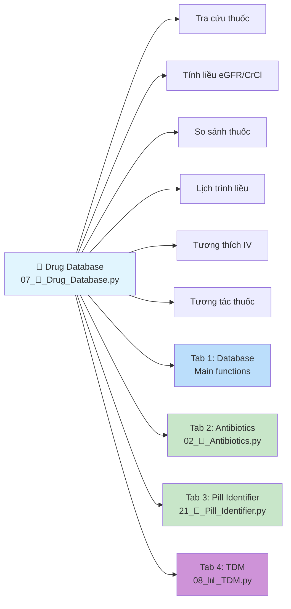
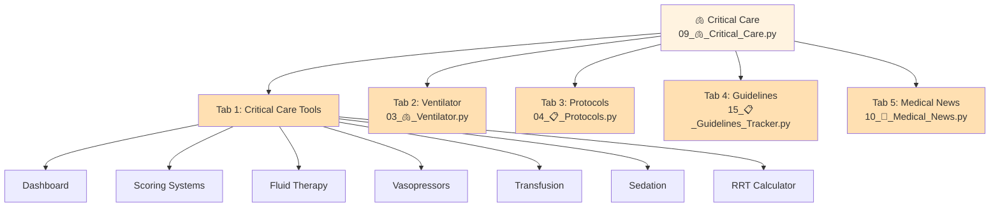
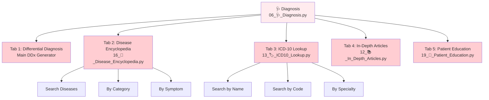
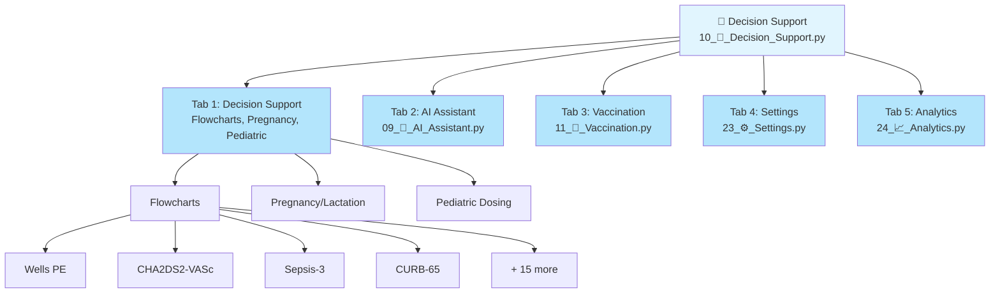
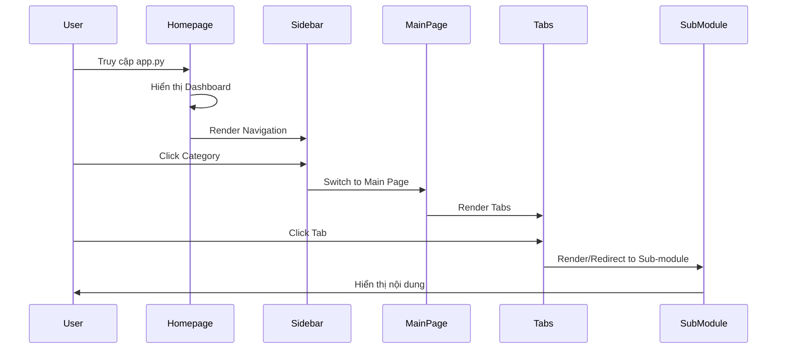
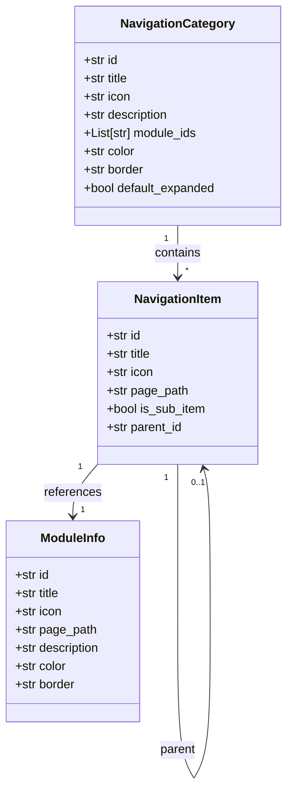

# Sơ đồ điều hướng hệ thống Clinical Assistant

## 1. Cấu trúc điều hướng tổng quan

```mermaid
graph TB
    Start[🏠 Trang chủ<br/>app.py] --> Sidebar[Sidebar Navigation]
    Start --> Homepage[Homepage Dashboard]
    
    Sidebar --> Cat1[🏠 Trang chủ & Tìm kiếm]
    Sidebar --> Cat2[💊 Thuốc & Liều dùng]
    Sidebar --> Cat3[📊 Tính toán & Thang điểm]
    Sidebar --> Cat4[🫁 Hồi sức & Phác đồ]
    Sidebar --> Cat5[🩺 Chẩn đoán & Tham khảo]
    Sidebar --> Cat6[🧭 Hỗ trợ & Công cụ]
    
    Cat1 --> MainMenu[00_🏠_Main_Menu.py]
    
    Cat2 --> DrugDB[07_💊_Drug_Database.py]
    DrugDB --> Tab1[Tab: Database]
    DrugDB --> Tab2[Tab: Antibiotics]
    DrugDB --> Tab3[Tab: Pill Identifier]
    DrugDB --> Tab4[Tab: TDM]
    
    Cat3 --> Scores[01_📊_Scores.py]
    Scores --> TabS1[Tab: Clinical Scores]
    Scores --> TabS2[Tab: Labs & Calculators]
    
    Cat4 --> CriticalCare[09_🫁_Critical_Care.py]
    CriticalCare --> TabC1[Tab: Critical Care Tools]
    CriticalCare --> TabC2[Tab: Ventilator]
    CriticalCare --> TabC3[Tab: Protocols]
    CriticalCare --> TabC4[Tab: Guidelines]
    CriticalCare --> TabC5[Tab: Medical News]
    
    Cat5 --> Diagnosis[06_🩺_Diagnosis.py]
    Diagnosis --> TabD1[Tab: Differential Diagnosis]
    Diagnosis --> TabD2[Tab: Disease Encyclopedia]
    Diagnosis --> TabD3[Tab: ICD-10 Lookup]
    Diagnosis --> TabD4[Tab: In-Depth Articles]
    Diagnosis --> TabD5[Tab: Patient Education]
    
    Cat6 --> DecisionSupport[10_🧭_Decision_Support.py]
    DecisionSupport --> TabDS1[Tab: Decision Support]
    DecisionSupport --> TabDS2[Tab: AI Assistant]
    DecisionSupport --> TabDS3[Tab: Vaccination]
    DecisionSupport --> TabDS4[Tab: Settings]
    DecisionSupport --> TabDS5[Tab: Analytics]
    
    style Start fill:#2D7DF6,color:#fff
    style Cat1 fill:#f5f5f5
    style Cat2 fill:#e8f5e9
    style Cat3 fill:#e3f2fd
    style Cat4 fill:#fff3e0
    style Cat5 fill:#ffebee
    style Cat6 fill:#e1f5fe
```

## 2. Chi tiết nhóm Thuốc & Liều dùng

## 3. Chi tiết nhóm Hồi sức & Phác đồ

## 4. Chi tiết nhóm Chẩn đoán & Tham khảo

## 5. Chi tiết nhóm Hỗ trợ & Công cụ

## 6. Luồng điều hướng từ Trang chủ

## 7. Cấu trúc dữ liệu Navigation

## 8. Tổng hợp số liệu

### Trang chính: 6 trang
- 🏠 Trang chủ
- 📊 Calculators & Thang điểm
- 💊 Cơ sở dữ liệu thuốc
- 🫁 Hồi sức
- 🩺 Chẩn đoán phân biệt
- 🧭 Hỗ trợ quyết định

### Sub-modules: 18 trang
- Tích hợp qua tabs trong các trang chính

### Navigation Categories: 6 nhóm
- Mỗi nhóm có 1-5 sub-modules

### Tabs Integration:
- Drug Database: 4 tabs ✅
- Critical Care: 5 tabs ✅
- Diagnosis: 5 tabs ⚠️ (chưa tích hợp hoàn toàn)
- Decision Support: 5 tabs ✅
- Scores: 2 tabs ✅

---

**Ghi chú:** 
- ✅ = Đã tích hợp hoàn toàn
- ⚠️ = Chưa tích hợp hoàn toàn (chỉ có redirect buttons)
